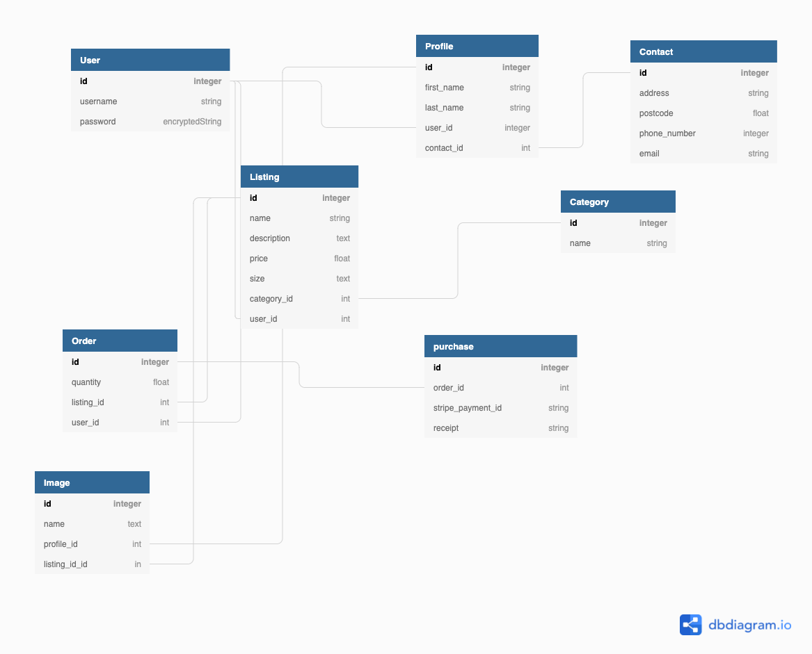
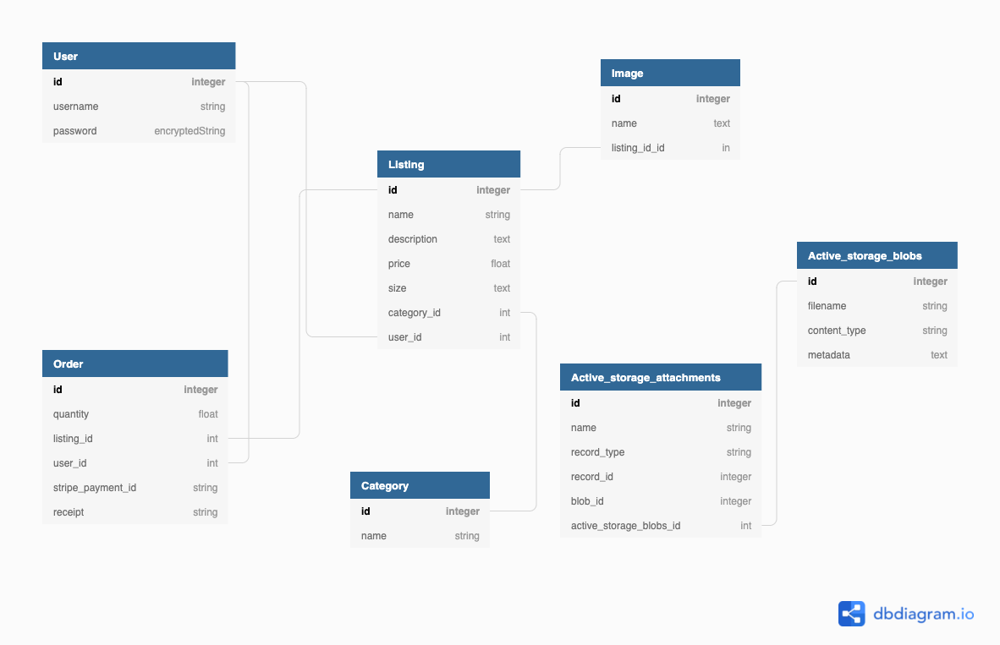

> R8	Why is it a problem that needs solving?

Retro/vintage clothing has slowly been coming back in style and becoming more and more popular around the globe. In fact, it is even getting to the point where it can be considered part of mainstream fashion. However, the issue facing the vintage clothing industry is the shortage of supply. The shortage of supply means that prices tend to be high and limites/slows the growth of the industry as a whole.
What most online shoppers are looking for is value for money, but importantly people want affordable prices which do not impact on quality, and vintage clothing can do just that. Generally, vintage clothing is made to such a high quality, because back in the day, clothing was made to last. There was no polyester, and the mindset was always quality over quantity. 
Supply needs to increase in order to ensure the industry continues to grow and attract more customers.

> R9	A link (URL) to your deployed app (i.e. website)

> R10	A link to your GitHub repository (repo).
- Ensure the repo is accessible by your Educators

> R11	Description of your marketplace app (website), including:

VinBT is your one-stop vintage clothing shop for all of your retro and vintage clothing! We love retro fashion and have an appreciation for super unique vintage finds. We  offer an abundance of vintage mens and women clothing. 


**Purpose**

- The purpose of VinBT is to provide a platform for ordinary people to buy and sell retro/vintage clothing. The aim is to increase supply of vintage clothing by providing a platform where any person can sell vintage clothing that they  might not even known they had but happened to be cleaning their closets and discovered a gem. We also want to provide fashion enthusiast that are into retro/vintage clothing with more options at a reasonable price.

**Functionality / features**

- User can create account and must be logged in for full site functionality, including creating listings, edit and delete them (in the profile page), and purchase them. If user are not logged in, they can view the listing page but cannot view an individual listing.

**Sitemap**

Initial Sitemap


Final Sitemap


A much more easier sitemap to understand. 

**Screenshots**

Home Page


Listings Page


Individual listing page


Create a listing page


Account page


Payment Page


**Target audience**

- The target audience for this application include both seller and buyer, ordinary people that are trying to get rid of vintage clothing that they don't want or fashion enthusiast that are into retro/vintage fashion. 

**Tech stack**

- HTML5,
- Bootstrap,
- Ruby Rails 
- SCSS 
- Javascript
- Stripe
- Devise
- Postgresql
- GitHub
- Heroku
- Trello
- Balsamiq
- VS Code

> R12	User stories for your app

**User administration:** 
As a user, I'd like to be able to make an account as a site visitor so that I can become a buyer or vendor. I want to be able to log in and out of my account at any moment so that my acount isn't left on. I want to be able to change my account password as so that i can improve my account's security by changing my password to a harder to guess. finally, I want to able to delete my account if I no longer want to use the application, so that no one else hack my account and make purchases.

**Management of listings:**
As a user, I want to be able to see all of the listings without having to check in as a site visitor (peson not signed in), so i can decide whether i want to create an account or not. I want to be able to click on "sell" to create listings in order to sell my clothes. I want to be click on the button "choose file" and upload an image my listings as a vendor. I want to be allowed to edit or delete my listings as a seller. As a user, I want to be able to see the all the listing, click on  "more details" to view the individaul listing and click in "Buy" to make a purchase.

**Authentication & Authorisation:**
As a user, I don't want other people to be able to access my account. I don't want other users to be able to create, update or delete my listings.

> R13	Wireframes for your app

Initial Wireframes


Final Wireframes 


> R14	An ERD for your app

Initial ERD 



Final ERD 



> R15	Explain the different high-level components (abstractions) in your app

VinBT is a Ruby on Rails two-sided marketplace application architected using MVC (Model, View, Controller). The view displays the user interface with minimum logic. With the help of bootstrape the view presents data from the model to the user. The controller being the brain of the application receives all the user input triggered form the view and translates it to commands for the model. The model is in charge of the application's data, logic, and rules of the application which it receices or adds to postgresql since its the prefered database. Methods for user permission, authentication (using devise) and data sanitization are used to protect the application from malicious activities.

> R16	Detail any third party services that your app will use

**Devise:** 
Devise enables user authentication, which is the act of evaluating whether someone who declares themselves to be is who they say they are. It allows my application to validate the user's identity and grant them access to resources. If a person is not logged in, they can only see parts of the site when they visit. Only after they have signed up may they browse a listing, create, amend, or delete the one they have created.

**Stripe:** The Stripe API provides a secure, simple, and user-friendly payment solution within the app, while Stripe handles all monetary transactions outside of the app, making customers feel safer.

**Amazon S3:** in conjunction with activestorage amazon s3 is used for image stotage that allows users upload to the site.

**Bootstrap:** is used for front-end development framework which allowed us to build a fully responsive websites. Put simply, it was used for styling the application.

**Ultrahook/Webhook:** used in conjunction with stripe to generate a receipt for for buyers


> R17	Describe your projects models in terms of the relationships (active record associations) they have with each other

A user can have multiple listings (`has_many: listings`), whereas a listing can belong to one user (`belongs_to: user`) and one category.
A listing can have one picture (`has_one_attached: picture`), this can be modified to `has_many_attached: picture` to allow for multiple pictures.
An order can have one user (`belongs_to: user`) and listing (`belongs_to :listing`) respectively. 

```
    class Listing < ApplicationRecord
        belongs_to :category
        belongs_to :user
        has_one_attached :picture
        before_save :remove_whitespace
    end

    class User < ApplicationRecord
        devise :database_authenticatable, :registerable,
         :recoverable, :rememberable, :validatable

        has_many :listings, dependent: :destroy   
    end

    class Category < ApplicationRecord
    end

    class Order < ApplicationRecord
        belongs_to :user
        belongs_to :listing
    end
```

> R18	Discuss the database relations to be implemented in your application

* User table has one relation with the Listing table. The primary key in user table (user_id) is used as a foreign key in listing table and this is for data normalisation. User also has a one relation with the profile table.

* Category table also has one relation to the listing, the primary key is used as foreign keys in listing table.

* Listing belongs to multiple tables such as User and Category. The primary keys in the User table(user_id), Category table (category_id) are used as foreign keys in the listing table. 

* Like Listing table, order table belongs to multiple tables such as User and Listing. The primary keys in the User table(user_id), Listing table (listing_id) are used as foreign keys in the order table. 

* Active record: The active storage tables are polymorphic and relate to images upload. A listing can have many pictures. No reference to this polymorphic association is made listing table however a `has_one_attached` relationship is defined in the listing model.


> R19	Provide your database schema design


> R20	Describe the way tasks are allocated and tracked in your project

The project was tracked and managed using Trello. I began by brainstorming application ideas and settled on VinBT. I then broke down the documentation questions based on the difficulty/what can be done with application. I worked on the least difficult questions first then moved on to creating my ERD. Creating the ERD allowed me to have a better understanding of some of the features the application must need. i then worked on create a visual representation of the application by creating my wireframes and sitemap. After that, I then starting coding and by creating, full CRUD functionality, user authentication using Devise, payment method with stripe and image upload using "AWS S3 bucket. I prioritized some of the documentation questions after between coding and then finally moved on to styling the application's pages.
<br>

Initial Trello


Final Trello

